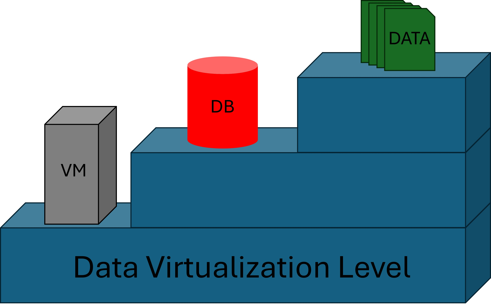

As a developer, you’ve been tasked with choosing the right cloud platform to host your application. 

### Range of Different Options
Pick the wrong platform, and you are stuck in a legacy platform, experience vendor lock-in, or spiraling costs. 

### Cloud as a service
Armed with the right knowledge, you can navigate between IaaS, PaaS and SaaS providers. 

### Start the implementation today 
It’s a journey of learning that empowers you to build with confidence and innovate without limits.

### Running code and storing data. 
Below you will find a list of Cloud providers providing different virtualization solutions. Where the level of virtualization ranges from 1 -> 3

### Code virtualization 

### Data virtualization 

